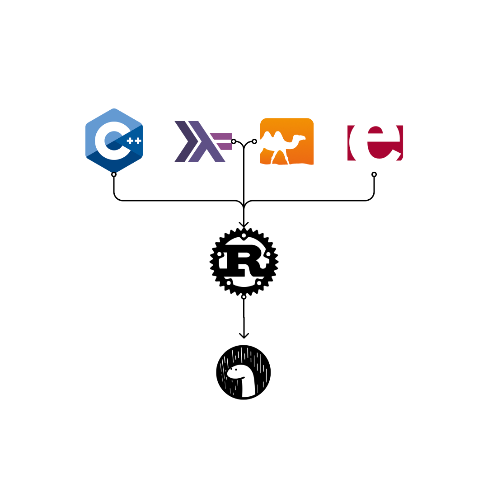

# Guia para Caracterização de Linguagens de Programação

+ Linguagem de Programação: Rust

  + [Apresentação e histórico](#apresenta--o-e-hist-rico)
  + [Características da Linguagem](#caracter-sticas-da-linguagem)
  + [Capacidades da Linguagem](#capacidades-da-linguagem)
  + [Produtividade do Desenvolvedor](#produtividade-do-desenvolvedor)
  + [Ecossistema](#ecossistema)
  + [Informações Adicionais](#informa--es-adicionais)
  + [Referências](#refer-ncias)

## Apresentação e histórico

O Rust é uma linguagem de programação multi-paradigma, focada em a performance, o seu desempenho é considerado um dos melhores entre as outras linguagens. Iniciada como projeto interno da Mozilla para resolver problemas vindo do C e C++ hoje é utilizada para diversas aplicações seja em partes do kernel do sistema operacional Linux ou para servidores web, qualquer coisa que precise de velocidade e confiabilidade.



Como o Rust é uma linguagem relativamente nova ainda não há filhos diretos mas o Deno é um runtime para o javascript com o compilador escrito em rust.

## Características da Linguagem

+ Paradigma: É multi paradigma porém é mais ligada a programação concorrente e a programação funcional.

+ Propósito: Ser rapida e segura.

+ Sistema de Tipagem: Possui a tipagem estatica e dinamica.

+ Ambiente de Execução: O Rust é uma linguagem compilada e executada como codigo de maquina e pode ser estendida com runtimes como o Tokio.

+ Implementação: Sua implementação é feita na propria linguagem ou seja é self-hosting com o C por exemplo.

+ Custos:
O seu principal custo é uma maior complexidade de desenvolvimento já que usa o conceito de ownership que é diferente da maioria das linguagens e pode levar um tempo para se acostumar. Como é mais low-level isso acaba tambem aumentando o custo de desenvolvimento.

## Capacidades da Linguagem

+ Metaprogramação: O rust possui os macros que são usados para extender a utilidade do programa assim podemos manipular a AST e gerarmos novos programas.

+ Gerenciamento de Ciclo de Vida: O Ciclo de vida no Rust é gerenciado pelo Ownership logo se uma variavel não tem dono ela é removida automaticamente.

+ Segurança: Devido a uma extensa checagem do compilador, o conceito de ownership e a separação da parte não segura do codigo com unsafe o rust é considerado uma das linguagens mais seguras da atualidade.

+ Performance: O rust por ser uma linguagem compilada e bastante optimizada é considerada uma das linguagens mais rapidas da atualidade.

+ Escalabilidade: O Rust é considerado bastante escalavel devida a sua performance e sistema de concorrência.

+ Confiabilidade: Graças a checagem extensiva do compilador e a separação do codigo unsafe o Rust é considerado uma das linguagens mais confiáveis da atualidade.

+ Concorrência e Threading: Uma das frases caracteristicas do rust é "Fearless Concurrency" ou seja concorrência sem medo o que descreve um grande forte da linguagem.

+ Custos: Por mais que possua uma grande capacidade e inumeras aplicações seus custos são relacionados a uma maior complexidade de desenvolvimento.

## Produtividade do Desenvolvedor

+ Frameworks e Contâiners

Um dos Frameworks mais utilizados para desenvolvimento de aplicações web é o [Tokio](https://tokio.rs/) que é um runtime que permite a execução de codigos assincronos.

O [Hyper](https://hyper.rs/) é um cliente HTTP para fazer e receber requisições HTTP assincronas.

+ Ferramentas Disponíveis

Como ferramentas temos o Rust language server que pode ser instalados em editores de texto para ajudar o desenvolvedor com o intellisense, o rust-fmt para formatar os arquivos .rs, o cargo para gerenciar os pacotes e cargo doc para gerar documentação do seu codigo.

+ Sintaxe, Semântica e Operações Predefinidas

### Estruturas de Controle

+ if:

```rust
if x == 4 {
    println!("x is four");
}
```

+ else e else if:

```rust
if x == 4 {
    println!("x is four");
} else if x == 3 {
    println!("x is three");
} else {
    println!("x is something else");
}
```

+ match:

O rust possui pattern matching que é uma forma de se comparar valores com um padrão e é exaustivo logo possui um _ que serve para definir um caso padrão.

```rust
let x = 1;

match x {
    1 => println!("one"),
    2 => println!("two"),
    3 => println!("three"),
    4 => println!("four"),
    5 => println!("five"),
    _ => println!("something else"),
}
```

+ if let:

O if let é uma estrutura de controle equivalente ao match porem mais concisa.

```rust
let dish = ("Ham", "Eggs");

// this body will be skipped because the pattern is refuted
if let ("Bacon", b) = dish {
    println!("Bacon is served with {}", b);
} else {
    // This block is evaluated instead.
    println!("No bacon will be served");
}

// this body will execute
if let ("Ham", b) = dish {
    println!("Ham is served with {}", b);
}

if let _ = 5 {
    println!("Irrefutable patterns are always true");
}
```

### Estrutura de Repetição

+ loop:

O rust possui um operador de loop infinito que é o loop.

```rust
loop {
    println!("again!");
}
```

+ while:

O while é uma estrutura de repetição que executa um bloco de código enquanto uma condição é verdadeira.

```rust
let mut i = 0;

while i < 10 {
    println!("hello");
    i = i + 1;
}
```

Tambem podemos usar o while let que usa o pattern matching para executar um bloco de código enquanto uma condição é verdadeira.

```rust
let mut x = vec![1, 2, 3];

while let Some(y) = x.pop() {
    println!("y = {}", y);
}

```

+ for:

Como loops de iteração temos o for.

```rust
let v = &["apples", "cake", "coffee"];

for text in v {
    println!("I like {}.", text);
}
```

e podemos utilizar uma sequencia de valores para iterar com o range operator(..):

```rust
let mut sum = 0;
for n in 1..11 {
    sum += n;
}
```

+ break e continue:

Temos tambem o break e o continue para interromper ou continuar a execução de um loop.

```rust

let (mut a, mut b) = (1, 1);
let result = loop {
    if b > 10 {
        break b;
    }
    let c = a + b;
    a = b;
    b = c;
};

let mut sum = 0;
for n in 1..11 {
  if n % 2 == 0 {
    continue;
  }
  sum += n;
}
```

+ Legibilidade
+ Redigibilidade
+ Custos

## Ecossistema

+ Maturidade

Por mais que seja uma linguagem relativamente nova já possui o apoio de empresas grandes como o Firefox, Dropbox, Cloudflare entre outros.

+ Comunidade

Sua comunidade tem crescido bastante e tem levado o premio de linguagem mais amada na pesquisa feita pelo Stack Overflow.

+ Governança

A governança do Rust é feito por meio de pedidos de comentários onde é debatido pela comunidade no repositorio do [rust](https://github.com/rust-lang/rfcs) no github.

+ Fragmentação

---

## Informações Adicionais

## Referências

1. <https://www.gartner.com/en/documents/2071615/programming-languages>
framework for assessing and characterizing programming languages and assessing their applicability to specific projects.

2. <https://doc.rust-lang.org/reference/notation.html>
Rust language reference.

3. <https://doc.rust-lang.org/book/>
Rust book.
