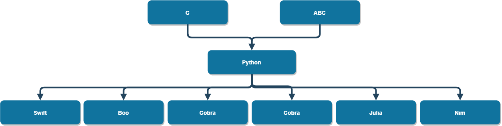

<!--
Recomendações:
1. A
2. B

Contribuidores:
+ Kenia e Luiz
+ Mauricio Santiago, Gustavo Santos, Matheus Novais, Ivens Joris, Matheus Silva
+ Álvaro Souza Oliveira; Carlos Mosselman Cabral Neto; Thiago Vieira Souza Andrade; Caio Nery Matos Santos; Vanessa Machado Araújo
+ Daniel

Fontes:
+ Criação do TOC
  + [Table of contents generated with markdown-toc](http://ecotrust-canada.github.io/markdown-toc/)
---

-->

# Guia para Caracterização de Linguagens de Programação

+ Linguagem de Programação: **Python**

  + [Apresentação e histórico](#apresenta--o-e-hist-rico)
  + [Características da Linguagem](#caracter-sticas-da-linguagem)
  + [Capacidades da Linguagem](#capacidades-da-linguagem)
  + [Produtividade do Desenvolvedor](#produtividade-do-desenvolvedor)
  + [Ecossistema](#ecossistema)
  + [Informações Adicionais](#informa--es-adicionais)
  + [Referências](#refer-ncias)

## Apresentação e histórico

Python é uma linguagem de programação multiparadigma de alto nível. Foi publicada em 1991 pelo seu criador Guido van Rossum. Seu nome é inspirado no programa de televisão britânico _Monty Python's Flying Circus_. Com a continuação do seu desenvolvimento, Python foi aos poucos ganhando popularidade devido à sua sintaxe simples, e alta legibilidade e redigibilidade, facilidade de extensão e flexibilidade. A linguagem está atualmente na versão 3.10 e seu desenvolvimento está ativo, sendo atualizada constantemente com novos recursos e otimizações. É atualmente uma das linguagens de programação mais populares no mundo, figurando em [alguns rankings](https://www.tiobe.com/tiobe-index/) em primeiro lugar. Atualmente é muito usada para projetos de inteligência artificial, visualização e ciência de dados, scripting para automação de tarefas e desenvolvimento web back-end.

##### Árvore genealógica do Python:



## Características da Linguagem

+ Paradigma
  : Python é uma linguagem multiparadigma que suporta POO, funcional, procedural e imperativa. Seu suporte a programação funcional não é ideal, porém, pois alguns constructos importantes para programação funcional não são simples de se fazer nela, tal qual estruturas de dados imutáveis por exemplo, e não há [(nem provavelmente será adicionada)](http://neopythonic.blogspot.com/2009/04/final-words-on-tail-calls.html) optimização de chamada de cauda. Embora não suporte nativamente a programação lógica, esse paradigma pode ser explorado através de módulos/extensões como o PySwip, interfaceando entre Python e SWI-Prolog. Python não obriga a orientação a objetos, mas a linguagem é implementada de forma que tudo é objeto, até mesmo as classes em si, tipos básicos e funções.
+ Propósito
  : Guido van Rossum, o criador da linguagem, começou a construí-la no seu tempo livre como um projeto para ser utilizado no seu trabalho, que envolvia administração de sistemas no sistema operacional [Amoeba](https://en.wikipedia.org/wiki/Amoeba_(operating_system)). Guido buscava criar uma linguagem para escrever scripts com maior capacidade de interação com as chamadas de sistema do que bsh, porém muito mais redigível que C. Para isso, se inspirou majoritariamente linguagens ABC e Modula.  
+ Sistema de Tipagem
  : Python é dinamicamente tipada, segue a ideia de "duck typing" e não requer declarações de tipos de variáveis antes de sua utilização, usando inferência de tipo ao atribuir um valor a um nome previamente inexistente no ambiente de referência atual. Apesar disso, Python é type-safe pois checa os tipos antes de realizar qualquer operação, resultando em exceção se as variáveis e valores envolvidos são de tipos inadequados, e também não permite cópia direta de uma região de memória inicializada com um tipo diferente do tipo do destino. A linguagem também oferece anotação opcional de tipos sem nenhuma consequência em tempo de compilação ou de execução (apenas aumenta legibilidade e auxilia o funcionamento de linters e utilitários checadores de tipos).
  A linguagem oferece os tipos escalares int, float, complex, bool e None. O tipo int tem precisão arbitrária nativamente, crescendo de acordo com a necessidade. Também oferece os tipos estruturados embutidos list, tuple, range, set, dict, str, bytearray e bytes, e para criar dados estruturados arbitrários há a declaração de classes.
  Em relação à orientação a objetos, Python oferece uma abordagem incompleta mas flexível. Métodos e atributos nunca são verdadeiramente privados, mas há uma convenção de que atributos cujo nome começa com dois underlines (__varname) devem ser tratados como privados. Pode-se oferecer acesso indireto a esses atributos através de getters e setters (anotação @property). Python suporta herança múltipla, embora seu algoritmo de ordem de resolução de métodos seja um pouco complicado. Não há suporte para declaração de interfaces. Polimorfismo é obtido através do uso de herança (polimorfismo de subtipo) e de "duck typing", não existindo polimorfismo paramétrico.
  Há apenas equivalência de tipos por nome. Há conversão implícita em certas operações se suportado. Sobrecarga de tipos é possível através de herança (declarar uma classe que heda de um certo tipo sem nenhuma modificação).
+ Ambiente de Execução
  : A linguagem é interpretada, e há diversos interpretadores implementados diferentemente para executá-la. Cada um desses oferece um ambiente de execução diferente com acesso a ferramentas distintas, mas o interpretador original da linguagem, CPython, oferece uma API para programas em C que implementa toda a comunicação necessária entre o Python e o C.
+ Implementação
  : A implementação original é chamada CPython, escrita em C. O CPython compila o código em Python para seu bytecode próprio e o interpreta. Outras implementações famosas são PyPy, que implementa um compilador para código de máquina nativo JIT que oferece um desempenho muito maior sem sacrificar o dinamismo da linguagem, Jython que compila para bytecode da JVM - Java Virtual Machine, permitindo interfaceamento e inserção dentro de programas Java e vice-versa e Cython, que é uma versão compilada do Python com ferramentas adicionais.
+ Custos
  : Embora a compatibilidade do Python com módulos escritos em C seja muito boa, os mecanismos de garbage collection e falta de mecanismos de gerencialmento de memória thread-safe têm um grande custo de performance devido principalmente ao mecanismo chamado Global Interpreter Lock (GIL). O GIL impede que uma seção de bytecode ou uma região de memória do Python seja executada por múltiplas threads ao mesmo tempo. Dessa forma, multithreading no Python traz muitas vezes ganhos de performance muito aquém do esperado. Sua tipagem dinâmica extremamente flexível também causa grandes perdas de performance, assim como a falta de compilação JIT na sua implementação de referência. Quando considerada como um todo entre as linguagens de programação mais populares, Python é sem dúvida a que tem a pior performance em geral. Isso é parcialmente contornado, entretanto, ao utilizar bibliotecas implementadas em C (amplamente disponíveis através do gerenciador de pacotes [pip](https://pip.pypa.io/en/stable/)) como o NumPy ou TensorFlow ao invés de implementar tudo em Python puro.

## Capacidades da Linguagem

+ Metaprogramação

  : Há três mecanismos que facilitam a metaprogramação em Python: metaclasses, decoradores e o uso de builtins redefiníveis ao invés de keywords ([via de regra](https://docs.python.org/3/reference/lexical_analysis.html#keywords)).
  Metaclasses herdam da classe _type_ e permitem adicionar regras e procedimentos arbitrários ao
  processo de declaração de uma nova classe. Com esse mecanismo, é possível verificar se uma classe foi definida de acordo com uma certa interface esperada, assegurar a obediência a uma certa convenção de nomenclatura dos métodos e atributos, executar operações sempre que uma classe é herdada por uma subclasse, etc.
  Decoradores são funções que tomam uma outra função como argumento (e quantos outros parâmetros sejam necessários) e "envelopam" essa função de alguma forma, estabelecendo alguma ação a ser executada antes e/ou depois de invocar essa função. Um exemplo é o decorador @functools.lru_cache, que estabelece um cache armazenando os últimos valores computados de qualquer função, evitando necessidade de recalcular valores previamente solicitados. Embora sejam declarados como funções quaisquer (que apenas retornam uma outra função), têm uma sintaxe própria ao serem utilizados: uma anotação na linha anterior à declaração da função, do tipo:

    ````Python
    @functools.lru_cache
    def fibonacci(x):
        if (x < 3):
            return 1
        return fibonacci(x-1) + fibonacci(x-2)
    ````

  : É notável que Python tem poucas palavras reservadas, a maioria dos nomes de funcionalidades embutidas da linguagem pode ser redefinido. Isso é muito útil para extender a linguagem. Abaixo, um exemplo onde a função embutida _len()_ (que retorna o tamanho de um objeto, ou o número de elementos se for uma coleção) é redefinida para, no caso de listas, não contar elementos _None_ (nulos) no total de elementos:
  
      ````Python
    def len(obj):
        if (type(obj) == list):
          return obj.__len__() - obj.count(None)
        
        return obj.__len__()
    ````
  
  : A redefinição de builtins como feito no exemplo só tem efeito no escopo local e não prejudica o funcionamento da linguagem em escopo global.

+ Gerenciamento de Ciclo de Vida
  Python conta com um garbage collector que conta as referências a um objeto e libera a memória ocupada por esse objeto assim que o número de referências a ela chegue a zero. Uma referência pode ser removida com redefinição do um nome (para então guardar a referência para um outro objeto), manualmente com a keyword _del_, ou pela a destruição do seu ambiente de referência(ao finalizar a execução da função, por exemplo).
+ Segurança
+ Performance
+ Escalabilidade
+ Confiabilidade
+ Concorrência e Threading
+ Custos
  _Custos aqui ..._

## Produtividade do Desenvolvedor

+ Frameworks e Contâiners
+ Ferramentas Disponíveis
+ Sintaxe, Semântica e Operações Predefinidas
  + Legibilidade
  + Redigibilidade
+ Custos

## Ecossistema

+ Maturidade
  : Python é uma linguagem com uma visão de projeto clara e muito bem estabelecida, um sistema de governança codificado na documentação do projeto e uma enorme comunidade de usuários. Durante 30 anos de existência em contínuo desenvolvimento, documentação, pacotes, bibliotecas e frameworks de alta qualidade e confiabilidade foram sendo acumulados. Python é, portanto, uma das linguagens de programação mais maduras dentre as mais utilizadas na atualidade.
+ Comunidade
  : Devido ao seu uso difundido, a comunidade de usuários e desenvolvedores da linguagem é vasta e seus membros são notavelmente tolerantes, respeitosos, acolhedores e muito amigável com iniciantes, sendo Python uma escolha comum na atualidade de primeira linguagem de programação também devido à sua forma de escrever que se aproxima em muitos aspectos da língua inglesa. Dezenas de conferências sobre a linguagem são organizadas independentemente todos os anos por todos os continentes, tendo uma conferência oficial reaizada nos Estados Unidos, a PyCon.
+ Governança
  : Atualmente o projeto Python (que é de código aberto e de licença GNU General Public License) é governado pela Python Software Foundation, uma organização sem fins lucrativos. Um conselho de cinco membros é eleito pela equipe oficial de desenvolvedores do núcleo da linguagem (Python core team) a cada lançamento de uma nova grande versão (aproximadamente uma vez ao ano). Não mais que dois membros do conselho podem ser empregados de uma mesma empresa para evitar conflitos de interesse.
  O _Python core team_ é uma lista de desenvolvedores com um histórico notável de contribuições (não somente em código) para o projeto da linguagem, cujo ingresso na lista foi votado por dois terços dos membros ativos da lista e não foi vetado pelo conselho. Já o conselho tem, através de votação por todos seus membros ,poderes de decisão e veto sobre as propostas de melhoramento da linguagem e gerenciar os canais e plataformas associadas à Python Software Foundation. O estatuto de governança da linguagem recomenda que o conselho "use seus poderes o mínimo possível, buscando procurar consenso e estabelecer regras ao invés de apenas decidir as situações caso a caso".
  Mudanças na linguagem são propostas através de PEPs (Python Enhancement Proposals), que são aceitas ou não pelo conselhos e então aplicadas na implementação de referência (CPython).
  Em geral, é fácil concluir que o Python tem um dos sistemas de governança mais robustos entre as linguagens de programação FOSS utilizadas na atualidade, o que sugere estabilidade e sucesso de longo prazo ao projeto.
+ Fragmentação
  : Embora haja múltiplas implementações da linguagem, não há em geral "forks" causados por discordâncias nas decisões de governância. Embora cada implementação alternativa tenha seu papel e usos mais apropriados que a implementação de referência, todas procuram seguir implementando as novas funcionalidades trazidas pela implementação principal exceto quando imprático ou impossível, mesmo se um pouco atrasadas na entrega. As comunidades de desenvolvedores das principais implementações alternativas têm um bom relacionamento com a comunidade que participa do desenvolvimento da principal, participando das decisões e muitas vezes contribuindo para ambos os projetos.

---

## Informações Adicionais

## Referências

1. https://www.gartner.com/en/documents/2071615/programming-languages
framework for assessing and characterizing programming languages and assessing their applicability to specific projects
2. https://docs.python.org/3/howto/functional.html
Functional Programming HOWTO - Python 3 Manual
3. https://github.com/yuce/pyswip
PySwip
4. https://docs.python.org/3/faq/general.html#what-is-python
General Python FAQ — Python 3.10.0 documentation - What is Python?
5. https://www.python.org/community/workshops/
Conferences and Workshops | Python.org
6. https://www.python.org/dev/peps/pep-0013/
PEP 13 -- Python Language Governance | Python.org
7. https://stackoverflow.com/a/36826546/11541975
oop - "public" or "private" attribute in Python ? What is the best way? - Stack Overflow
8. https://medium.com/fintechexplained/advanced-python-metaprogramming-980da1be0c7d
Advanced Python: Metaprogramming - Explaining what, why and how Metaprogramming works in Python - Farhad Malik - Medium
