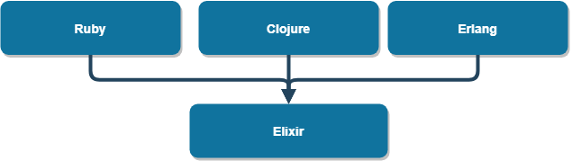

<!--
Recomendações:
1. A
2. B

Contribuidores:
+ Kenia e Luiz
+ Mauricio Santiago, Gustavo Santos, Matheus Novais, Ivens Joris, Matheus Silva
+ Álvaro Souza Oliveira; Carlos Mosselman Cabral Neto; Thiago Vieira Souza Andrade; Caio Nery Matos Santos; Vanessa Machado Araújo
+ Daniel

Fontes:
+ Criação do TOC
  + [Table of contents generated with markdown-toc](http://ecotrust-canada.github.io/markdown-toc/)
---

-->

# Guia para Caracterização de Linguagens de Programação

+ Linguagem de Programação: **Elixir**

  + [Apresentação e histórico](#apresenta--o-e-hist-rico)
  + [Características da Linguagem](#caracter-sticas-da-linguagem)
  + [Capacidades da Linguagem](#capacidades-da-linguagem)
  + [Produtividade do Desenvolvedor](#produtividade-do-desenvolvedor)
  + [Ecossistema](#ecossistema)
  + [Informações Adicionais](#informa--es-adicionais)
  + [Referências](#refer-ncias)

## Apresentação e histórico

Elixir é uma linguagem de programação funcional e concorrente dinâmica e moderna criada em 2011 pelo desenvolvedor brasileiro José Valim, suportando metaprogramação e polimorfismo (através de seus [protocolos](https://elixir-lang.org/getting-started/protocols.html)). Executa na máquina virtual Beam permitindo que interaja e se componha com os programas e bibliotecas disponíveis no Erlang. Tem como objetivo facilitar a construção de aplicações de baixa latência em tempo real, distribuídas e tolerantes a falhas. É empregada no backend de vários serviços e websites como o Pinterest, Moz, The Financial Times, bet365 e Discord. Segundo o [TIOBE index](https://www.tiobe.com/tiobe-index/), Elixir é uma das 100 linguagens de programação mais populares atualmente, e essa tendência de ganho de popularidade deve-se principalmente à sua excelente performance e ao seu aspecto moderno unido ao rescente crescimento da popularidade da programação funcional.

##### Árvore genealógica do Elixir:



## Características da Linguagem

+ Paradigma
  : A linguagem provê uma coleção de ferramentas ricas para o paradigma de programação funcional, que são complementadas por uma série características e constructos que favorecem a programação concorrente. A linguagem também oferece um processador de macros poderoso, tornando-se uma das linguagens de programação mais propícias à metaprogramação.
+ Propósito
  : Foi criada para melhorar a produtividade e capacidade de extensão dentro da máquina virtual do Erlang, ainda mantendo interoperabilidade com as bibliotecas existentes para o Erlang. O objetivo foi de criar uma linguagem com baixa latência, alta performance e capacidade para processar muitos dados com eficiência, trazendo características de outras linguagens modernas ao ecossistema Erlang.
+ Sistema de Tipagem
  : Elixir é dinamicamente tipada e oferece uma sintaxe para anotações de tipos chamada Typespecs, que não é utilizada pelo compilador (e sim apenas por ferramentas externas). Elixir é type-safe, fortemente tipada, mas as verificações são feitas em tempo de execução. Tem inferência de tipo, mas nem sempre é possível determinar o tipo de uma expressão antes da execução pois é dinamicamente tipada. Exceto para tipos numéricos em expressões aritméticas, Elixir não tem coerção de tipos. Conversão, exceto nesses casos, é sempre explícita. Não há equivalência estrutural de tipos, apenas por nome. É possível realizar sobrecarga de tipos, mas o alias criado só é útil para anotação de tipos e não importa para a execução do código.
  Os tipos escalares do Elixir são integer, float, boolean e atom (significa basicamente o mesmo que "símbolo"), enquanto que os tipos de dados estruturados são String, list, tuple, map, keyword list. Para criar dados estruturados arbitrários, há structs e "custom Types".
  Suporta polimorfismo de subtipo através do mecanismo de "protocols". Um protocol define funções que devem implementadas para tipos diferentes, possibilitando assim que o mesmo nome de função trabalhe com vários tipos.
+ Ambiente de Execução
  : O Elixir é compilado para bytecode da máquina virtual da linguagem Erlang, BEAM (_Bogdan/Björn's Erlang Abstract Machine_). Bytecode gerado pela Elixir é completamente compatível com bytecode Erlang, portanto o ambiente de execução do Elixir inclui todas as bibliotecas e programas disponíveis também para o Erlang, e mantém as mesmas capacidades de interface com bibliotecas e programas de outras linguagens e do sistema operacional. Arquivos podem ser compilados previamente (.ex) ou compilados concomitantemente à execução (.exs).
+ Implementação
  : Embora as versões iniciais do Elixir tenham sido escritas em Erlang, a linguagem é atualmente implementada majoritariamente com código em Elixir, com uma porcentagem significativa mas minoritária de seu código em Erlang. A implementação consta em um compilador que traduz os arquivos ".ex" em arquivos ".beam", e um interpretador que na verdade compila os arquivos ".exs" em memória ao ser solicitada a execução e executa o bytecode gerado. Um detalhe importante de se destacar é que recentemente a máquina virtual BEAM implementou rotinas de compilação JIT, e mesmo sem participação direta dos desenvolvedores do Elixir a linguagem teve um ganho de desempenho considerável.
+ Custos
  : As funcionalidades e características do Elixir não trazem grandes custos em questão de performance, visto que Elixir é uma linguagem com performance comparável com linguagens funcionais similares. O maior custo associado a trabalhar com Elixir é o de aprendizado (para desenvolvedores não familiares com o paradigma funcional) e de contratação (encontrar bons desenvolvedores no paradigma funcional é um pouco mais custoso), porém isso é mitigado pela maior produtividade associada ao uso de linguagens funcionais, contribuindo para necessidade de times menores de desenvolvedores.

## Capacidades da Linguagem

+ Metaprogramação
  : Elixir dá ao programador acesso à árvore sintática abstrata (AST) das expressões através do comando _quote_, e permite modificações/injeções nessa árvore sintática usando o comando _unquote_. Utilizando essa funcionalidade o programador pode definir macros através do comando _defmacro_, que define uma expressão a ser substituída em tempo de compilação pela _quote_ especificada. Em Elixir, existe ainda a possibilidade de definição de macros privados através do comando _defmacrop_, disponíveis apenas no mesmo módulo que pertencem, e macros têm seu próprio escopo (também chamado de "macros higiênicos"), isto é, variáveis utilizada dentro de um bloco _quote_ não interferem com variáveis do mesmo nome fora do bloco quote a menos que especificado o contrário (através da função var!/2)
  Macros são uma funcionalidade poderosa de metaprogramação e as recomendações pela comunidade Elixir são que sejam usados raramente e com muito cuidado, pois dificultam a indentificação de erros e potencialmente a compreensão do código.
+ Gerenciamento de Ciclo de Vida
  : Elixir tem os mesmos mecanismos de garbage collection oferecidos no Erlang (por executar na mesma máquina virtual), que usa um mecanismo misto de garbage collection de rastreamento e de contagem de referências.
+ Segurança
  : Elixir é completamente thread-safe: não existem threads, apenas processos "leves" da máquina Erlang que não podem compartilhar qualquer memória, e apenas se comunicam por mensagens. A segurança de ser thread-safe permite programação paralela muito mais fácil para o programador.
  Apesar de ter checagem de tipos dinâmica, o sistema de tipos do elixir é fortemente tipado (não aceita conversões implícitas com perda de precisão) e portanto podemos afirmar que Elixir é type safe. Abaixo, um exemplo de operação não permitida:
    ```
    iex> {"chave", "valor"} ++ [0]         
    ** (ArgumentError) argument error
        :erlang.++({"chave", "valor"}, [0])
    ```
  : O mecanismo de garbage collection assegura memory safety em Elixir.
+ Performance
  : Elixir é significantemente mais lenta na maior parte dos casos do que linguagens compiladas como C++, Go ou Java, porém tem performance melhor que Ruby ou Python, por exemplo. A performance do Elixir é ainda melhor quando em situações que empregam algoritmos favoráveis à concorrência, sendo o código concorrente limpo e eficiente em Elixir também mais fácil de produzir do que em Go ou Java.
+ Escalabilidade
  : O paralelismo robusto e de alta performance no Elixir permite que aplicações executem em clusters de servidores (e em servidores com muitos processadores) praticamente tão bem como em um único servidor. Alta performance faz com que upgrades sejam necessários com menos frequência e a concorrência permite que upgrades sejam mais flexíveis e fáceis de executar. Elixir é, portanto, altamente escalável para a computação distribuída.
+ Confiabilidade
  : Após 9 anos desde sua criação, executando numa máquina virtual com ainda mais tempo de existência, e criando uma comunidade significativa de contribuidores para o desenvolvimento e uso da linguagem identificando e corrigindo bugs com prontidão, pode-se dizer com segurança que Elixir é uma linguagem suficientemente confiável para ser usada para escrever aplicativos usados em produção em grandes organizações como Pinterest e Discord.
+ Concorrência e Threading
  : Poucas linguagens de programação têm a mesma robustez e performance do Elixir para programação concorrente. Processos da máquina virtual Erlang não compartilham memória e só se comunicam através de mensagens. Algumas abstrações para executar operações paralelamente são os _Agents_ e ,_Tasks_, mas a linguagem tem várias outras funcionalidades voltadas à concorrência e paralelismo. 
  Agents mantém um estado e podem ser atualizados em plano de fundo (por outro processo) de acordo com as instruções do programador (por meio de uma função anônima levando como argumento o estado atual).
  Tasks executam funções de forma assíncrona.

## Produtividade do Desenvolvedor

+ **Frameworks e Contâiners**
  + [Phoenix](https://phoenixframework.org/)
    : Phoenix é o maior framework de desenvolvimento web moderno do ecossistema Elixir, utilizando como base a arquitetura MVC com modificações adequadas à programação funcional. Seu leque de ferramentas é extenso e o framework é muito versátil, sendo uma das portas de entrada para novos desenvolvedores escolherem utilizar Elixir nos seus websites.
  + [ExUnit](https://hexdocs.pm/ex_unit/1.12/ExUnit.html)
    : O framework de testes de unidade do Elixir, muito completo e integrado ao Mix.
  + [Nerves](https://www.nerves-project.org/index.html)
    : Nerves é um framework focado em desenvolvimento de software para dispositivos embarcados utilizando Elixir. Com o Nerves é possível criar aplicações muito pequenas, portáveis e eficientes utilizando recursos oferecidos pelo framework.
  + [Hedwig](https://github.com/hedwig-im/hedwig)
    : Hedwig auxilia desenvolvedores Elixir a criar chatbots interativos através de interfaces de texto.
  + [Plug](https://hexdocs.pm/plug/readme.html)
    : Um framework para construir intefaces de comunicação entre servidores, frameworks e aplicações Erlang e Elixir em geral. Oferece seu próprio módulo de testes, o _Plug.Test_. É uma parte oficial do projeto Elixir mantido pelos próprios desenvovedores da linguagem.
  + [Trot](https://github.com/hexedpackets/trot)
    : Uma alternativa ao Plug que oferece soluções mais fáceis e simples para casos mais complexos de uso do Plug, em especial para a construção de APIs.
  + [Kitto](https://kitto.io/dashboards/sample)
    : O framework Kitto auxilia a criação de dashboards exibidas utilizando o framework React no front-end, gerados no back-end utilizand o Elixir.
  + [Flowex](https://github.com/antonmi/flowex)
    : Um framework que oferece abstrações para permitir o uso do paradigma de Programação Baseada em Fluxo. Foi recentemente deprecado em prol de um novo projeto, o [ALF](https://github.com/antonmi/alf).
+ Ferramentas Disponíveis
  + [Mix](https://elixir-lang.org/getting-started/mix-otp/introduction-to-mix.html)
    : Mix é uma ferramenta de construção de aplicações inclusa no Elixir que gerencia dependências, testes e compilação de uma aplicação Elixir. Mix gera uma estrutura de projeto padronizada onde vários parâmetros podem ser editados, como as dependências e ambiente do projeto.
  + [Hex](https://hex.pm/)
    : Hex é o gerenciador de pacotes que distribui módulos para todo o ecossistema Erlang, incluindo Elixir. É utilizável através do Mix no Elixir e através do Rebar3 no Erlang. Desenvolvedores publicam pacotes e a respectiva documentação através do Mix, seguindo um guia disponível no site. Desenvolvedores Elixir ou Erlang podem requerir qualquer pacote do Hex nas suas aplicações, que serão automaticamente instalados pelo Mix ou Rebar3.
  + [Livebook](https://github.com/livebook-dev/livebook)
    : Livebook é uma aplicação em Elixir similar ao Jupyter notebooks em Python, construído usando o Phoenix LiveView. Ele pode integrar projetos Elixir e executar pequenos trechos de código dentro do próprio Livebook, exibindo os resultados, além de permitir criação de hypertexto em um subconjunto do Markdown.
+ Sintaxe, Semântica e Operações Predefinidas
  + Estruturas de Controle
    + Seleção
      + case:
        : O case recebe um valor e o compara com diversos padrões. Caso haja casamento, entre o valor e o padrão, executa o código especificado após a seta '->'. Senão tiver nenhum casamento, ocorre uma exceção.

          ```Elixir
          case {:algo, :outracoisa} do
              {"a","b"} ->
                  "Resultado é {\"a\",\"b\"}"
              {:algo, variavel_sem_valor_atribuido} ->
                  "variavel_sem_valor_atribuido agora é igual a :outracoisa"
              _ ->
                  "O símbolo de underline dá match em qualquer coisa"
                  "Ou seja, isso serve como o 'else' do case"
          end
          ```

      + cond:
        : O cond verifica as condições e executa o bloco de comandos referente à primeira condição verdadeira. No Elixir, apenas 'nil' e 'false' são valores falsos, todo o resto é verdadeiro.

          ```Elixir
          cond do
            false -> 
                "Falso não será executado"
            true -> "Será executado" 
          end
          ```

      + if e unless:
        : O if simplesmente recebe uma expressão, verifica se é verdadeira e executa se for. O unless é o contrário do if, isto é, executa quando a expressão é falsa. Após um if ou unless pode-se usar um else (opcionalmente). If e unless são implementados através de macros no Elixir, virando apenas um cond.

        ```Elixir
        if true do
          "vai executar o que estiver aqui"
        else
          "não vai executar pois a expressão lá encima é verdadeira."
        end
        ```

    + Repetição
      : Não há loops no Elixir. Toda repetição é feita através de recursão, otimizada através da otimização de chamada de cauda.
    + Exceções
      : Em Elixir, muitas situações em que erros ocorrem não são tratadas com exceções, e sim átomos denotando o sucesso ou não da operação (_:error_ e _:ok_, por exemplo). O mecanismo de tratamento de exceções é robusto e flexível, contando com as keywords raise, try, rescue, catch, throw, reraise, after e else.
  + Legibilidade e Redigibilidade
    : Elixir não é conhecida por ter uma sintaxe de particular má legibilidade, e devido ao seu design moderno tem uma legibilidade média. Um constructo que melhora muito a legibilidade e redigibilidade, por exemplo, é o _pipe operator_. Chamadas de funções aninhadas podem ser reescritas da seguinte maneira:

      ```Elixir
      aninhadas(funcoes(chamando(argumento))) # isso

      argumento                               # vira isso
          |> chamando 
          |> funcoes 
          |> aninhadas 

      ```

    Elixir também tem as _guards_, que permitem definições distintas para funções no caso de valores específicos.

      ```Elixir
      defmodule F do
        def factorial(0): do: 1
        def factorial(n): do
          n * factorial(n-1)
        end
      ```

## Ecossistema

+ Maturidade
  : Embora tenha apenas 9 anos de existência, o Elixir é uma linguagem estável e executa numa máquina virtual ainda mais robusta que antecede a sua criação. A interoperabilidade com programas e módulos escritos em Erlang, tal como uma coleção de bibliotecas que já ultrapassa 12 mil pacotes individuais torna o ecossistema do Elixir maduro o suficiente para a construção de aplicações críticas, como bem exemplificado pela adoção da linguagem em grandes organizações como Pinterest, Discord, PepsiCo, Slack, Postmates e Moz.
+ Comunidade
  : A comunidade em torno do Elixir é amigável e acolhedora, e em geral seus membros são fãs fervorosos da linguagem que se dedicam para acelerar a sua adoção e crescimento da sua popularidade. O time oficial de desenvolvedores da linguagem mantém um [fórum](https://elixirforum.com/about) relativamente movimentado, com quase 3 mil usuários ativos e 425 novos tópicos de discussão por mês.
+ Governança
  : Um time (Elixir Core Team) de seis membros controla o projeto open-source oficial da linguagem. Não há estatutos que regem decisões e processo de governança.
+ Fragmentação
  : Até hoje nunca houve implementações alternativas ou forks da linguagem, portanto podemos afirmar que a fragmentação de seu ecossistema é zero.

---

## Referências

1. https://www.gartner.com/en/documents/2071615/programming-languages
framework for assessing and characterizing programming languages and assessing their applicability to specific projects
2. https://elixirforum.com/t/jit-in-erlang-what-does-it-mean-for-elixir/34311/2
JIT in Erlang – what does it mean for Elixir?
3. https://github.com/elixir-lang/elixir
Github - elixir-lang/elixir
4. https://www.monterail.com/blog/famous-companies-using-elixir
Eight Famous Companies Using Elixir—And Why They Made the Switch
5. https://hex.pm/packages
Packages | Hex
6. https://elixirschool.com/en/lessons/advanced/metaprogramming/
Metaprogramming · Elixir School
7. https://blog.appsignal.com/2021/09/07/an-introduction-to-metaprogramming-in-elixir.html
An Introduction to Metaprogramming in Elixir | AppSignal Blog
8. https://blog.appsignal.com/2021/11/16/pitfalls-of-metaprogramming-in-elixir.html
Pitfalls of Metaprogramming in Elixir | AppSignal Blog
9. https://www.erlang-solutions.com/blog/erlang-garbage-collector/
Erlang Garbage Collector - Erlang Solutions
10. https://dockyard.com/blog/2021/03/30/elixir-is-safe
Elixir is Safe - DockYard
11. https://stressgrid.com/blog/benchmarking_go_vs_node_vs_elixir/
Benchmarking Go vs Node vs Elixir
12. https://dockyard.com/blog/2020/05/28/scaling-up-with-elixir
Scaling Up With Elixir - DockYard
13. https://elixirschool.com/en/lessons/intermediate/concurrency
Concurrency · Elixir School
14. https://elixir-lang.org/getting-started/try-catch-and-rescue.html
try, catch, and rescue - The Elixir programming language
